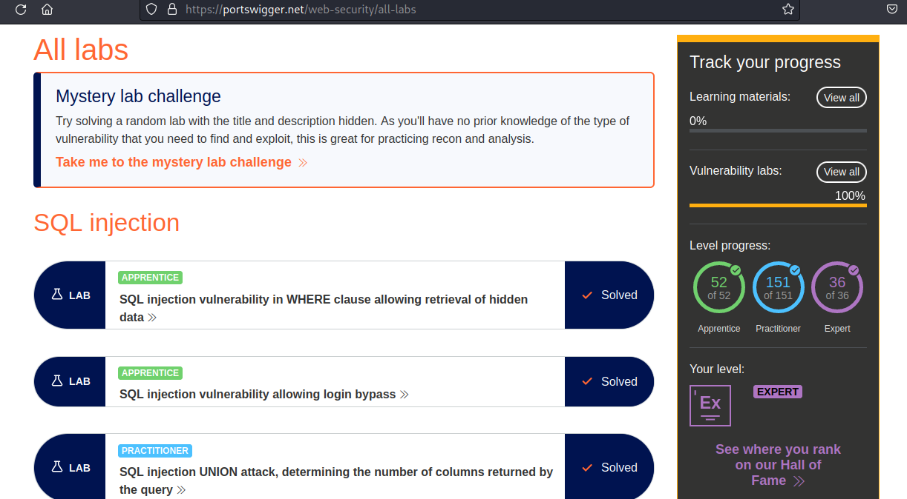

# PORTSWIGGER Web Security Academy Scripts



FOR EDUCATIONAL PURPOSE ONLY

Written in python3, these scripts would probably have been cleaner.
Feel free to hack and improve them to your liking. 


**Usages:**

```bash
python3 exploit-lab01.py https://xxxxxxxxxx.web-security-academy.net <YOUR_PAYLOAD>
python3 exploit-lab01.py https://xxxxxxxxxx.web-security-academy.net SOLUTION
python3 exploit-lab01.py https://xxxxxxxxxx.web-security-academy.net "SOLUTION1"
python3 exploit-lab01.py https://xxxxxxxxxx.web-security-academy.net 'SOLUTION2'
python3 exploit-lab01.py https://xxxxxxxxxx.web-security-academy.net $(cat <YOUR_PAYLOAD_FILE>)

python3 exploit-lab01.py <TARGET> <ATTACKER>
python3 exploit-lab01.py https://xxxxxxxxxx.web-security-academy.net https://xxxxxxxxxx.exploit-server.net
python3 exploit-lab01.py https://xxxxxxxxxx.web-security-academy.net https://xxxxxxxxxx.exploit-server.net SOLUTION
python3 exploit-lab01.py https://xxxxxxxxxx.web-security-academy.net https://xxxxxxxxxx.exploit-server.net $(cat <YOUR_PAYLOAD_FILE>)

python3 exploit-lab01.py <TARGET> <ATTACKER> <COLLABORATOR>
python3 exploit-lab01.py https://xxxxxxxxxx.web-security-academy.net https://xxxxxxxxxx.exploit-server.net xxxxxxxxxx.oastify.com
python3 exploit-lab01.py https://xxxxxxxxxx.web-security-academy.net https://xxxxxxxxxx.exploit-server.net xxxxxxxxxx.oastify.com SOLUTION
python3 exploit-lab01.py https://xxxxxxxxxx.web-security-academy.net https://xxxxxxxxxx.exploit-server.net xxxxxxxxxx.oastify.com $(cat <YOUR_PAYLOAD_FILE>)
```


**Categories:**
- [SQL Injection](https://github.com/gwyomarch/WebSecurityAcademy/tree/main/SQLInjection#sql-injection): 17/17
- [XSS (Cross-Site Scripting)](https://github.com/gwyomarch/WebSecurityAcademy/tree/main/XSS#xss): 30/30
- [CSRF (Cross-Site Request Forgery)](https://github.com/gwyomarch/WebSecurityAcademy/tree/main/CSRF#csrf): 12/12
- [ClickJacking](https://github.com/gwyomarch/WebSecurityAcademy/tree/main/ClickJacking#clickjacking): 5/5
- [DOM-Based XSS](https://github.com/gwyomarch/WebSecurityAcademy/tree/main/DOMBasedXSS#dombasedxss): 7/7
- [CORS (Cross-Origin Resource Sharing)](https://github.com/gwyomarch/WebSecurityAcademy/tree/main/CORS#cors): 3/4
- [XXE (XML External Entity injection)](https://github.com/gwyomarch/WebSecurityAcademy/tree/main/XXE#xxe): 9/9
- [SSRF (Server-Side Request Forgery)](https://github.com/gwyomarch/WebSecurityAcademy/tree/main/SSRF#ssrf): 7/7
- [HTTP Request Smuggling](https://github.com/gwyomarch/WebSecurityAcademy/tree/main/RequestSmuggling#http-request-smuggling): 22/22
- [OS Command Injection](https://github.com/gwyomarch/WebSecurityAcademy/tree/main/OSCommandInjection/#os-command-injection) 5/5
- [SSTI (Server-Side Template Injection)](https://github.com/gwyomarch/WebSecurityAcademy/tree/main/OSCommandInjection/#ssti) 7/7

## [SQL Injection](https://github.com/gwyomarch/WebSecurityAcademy/tree/main/SQLInjection#sql-injection)


### [**Script 01**](https://github.com/gwyomarch/WebSecurityAcademy/blob/main/SQLInjection/exploit-lab01.py)

Lab: [SQL injection vulnerability in WHERE clause allowing retrieval of hidden data](https://portswigger.net/web-security/sql-injection/lab-retrieve-hidden-data)

Difficulty: APPRENTICE


### [**Script 02**](https://github.com/gwyomarch/WebSecurityAcademy/blob/main/SQLInjection/exploit-lab02.py)

Lab: [SQL injection vulnerability allowing login bypass](https://portswigger.net/web-security/sql-injection/lab-login-bypass)

Difficulty: APPRENTICE


### [**Script 03**](https://github.com/gwyomarch/WebSecurityAcademy/blob/main/SQLInjection/exploit-lab03.py)
Lab: [SQL injection UNION attack, determining the number of columns returned by the query](https://portswigger.net/web-security/sql-injection/union-attacks/lab-determine-number-of-columns)

Difficulty: PRACTITIONER


### [**Script 04**](https://github.com/gwyomarch/WebSecurityAcademy/blob/main/SQLInjection/exploit-lab04.py)

Lab: [SQL injection UNION attack, finding a column containing text](https://portswigger.net/web-security/sql-injection/union-attacks/lab-find-column-containing-text)

Difficulty: PRACTITIONER


### [**Script 05**](https://github.com/gwyomarch/WebSecurityAcademy/blob/main/SQLInjection/exploit-lab05.py)

Lab: [SQL injection UNION attack, retrieving data from other tables](https://portswigger.net/web-security/sql-injection/union-attacks/lab-retrieve-data-from-other-tables)

Difficulty: PRACTITIONER


### [**Script 06**](https://github.com/gwyomarch/WebSecurityAcademy/blob/main/SQLInjection/exploit-lab06.py)

Lab: [SQL injection UNION attack, retrieving multiple values in a single column](https://portswigger.net/web-security/sql-injection/union-attacks/lab-retrieve-multiple-values-in-single-column)

Difficulty: PRACTITIONER


### [**Script 07**](https://github.com/gwyomarch/WebSecurityAcademy/blob/main/SQLInjection/exploit-lab07.py)

Lab: [SQL injection attack, querying the database type and version on Oracle](https://portswigger.net/web-security/sql-injection/examining-the-database/lab-querying-database-version-oracle)

Difficulty: PRACTITIONER


### [**Script 08**](https://github.com/gwyomarch/WebSecurityAcademy/blob/main/SQLInjection/exploit-lab08.py)

Lab: [SQL injection attack, querying the database type and version on MySQL and Microsoft](https://portswigger.net/web-security/sql-injection/examining-the-database/lab-querying-database-version-mysql-microsoft)

Difficulty: PRACTITIONER


### [**Script 09**](https://github.com/gwyomarch/WebSecurityAcademy/blob/main/SQLInjection/exploit-lab09.py)

Lab: [SQL injection attack, listing the database contents on non-Oracle databases](https://portswigger.net/web-security/sql-injection/examining-the-database/lab-listing-database-contents-non-oracle)

Difficulty: PRACTITIONER


### [**Script 10**](https://github.com/gwyomarch/WebSecurityAcademy/blob/main/SQLInjection/exploit-lab10.py)

Lab: [SQL injection attack, listing the database contents on Oracle](https://portswigger.net/web-security/sql-injection/examining-the-database/lab-listing-database-contents-oracle)

Difficulty: PRACTITIONER


### [**Script 11**](https://github.com/gwyomarch/WebSecurityAcademy/blob/main/SQLInjection/exploit-lab11.py)

Lab: [Blind SQL injection with conditional responses](https://portswigger.net/web-security/sql-injection/blind/lab-conditional-responses)

Difficulty: PRACTITIONER


### [**Script 12**](https://github.com/gwyomarch/WebSecurityAcademy/blob/main/SQLInjection/exploit-lab12.py)

Lab: [Blind SQL injection with conditional errors](https://portswigger.net/web-security/sql-injection/blind/lab-conditional-errors)

Difficulty: PRACTITIONER


### [**Script 13**](https://github.com/gwyomarch/WebSecurityAcademy/blob/main/SQLInjection/exploit-lab13.py)

Lab: [Blind SQL injection with time delays](https://portswigger.net/web-security/sql-injection/blind/lab-time-delays)

Difficulty: PRACTITIONER


### [**Script 14**](https://github.com/gwyomarch/WebSecurityAcademy/blob/main/SQLInjection/exploit-lab14.py)

Lab: [Blind SQL injection with time delays and information retrieval](https://portswigger.net/web-security/sql-injection/blind/lab-time-delays-info-retrieval)

Difficulty: PRACTITIONER


### [**Script 15**](https://github.com/gwyomarch/WebSecurityAcademy/blob/main/SQLInjection/exploit-lab15.py)

Lab: [Blind SQL injection with out-of-band interaction](https://portswigger.net/web-security/sql-injection/blind/lab-out-of-band)

Difficulty: PRACTITIONER

- Requires Burp Collaborator (BurpSuite Pro)


### [**Script 16**](https://github.com/gwyomarch/WebSecurityAcademy/blob/main/SQLInjection/exploit-lab16.py)

Lab: [Blind SQL injection with out-of-band data exfiltration](https://portswigger.net/web-security/sql-injection/blind/lab-out-of-band-data-exfiltration)

Difficulty: PRACTITIONER

- Requires Burp Collaborator (BurpSuite Pro)

### [**Script 17**](https://github.com/gwyomarch/WebSecurityAcademy/blob/main/SQLInjection/exploit-lab17.py)

Lab: [SQL injection with filter bypass via XML encoding](https://portswigger.net/web-security/sql-injection/lab-sql-injection-with-filter-bypass-via-xml-encoding)

Difficulty: PRACTITIONER


## [XSS (Cross-Site Scripting)](https://github.com/gwyomarch/WebSecurityAcademy/tree/main/XSS#xss)


### [**Script 01**](https://github.com/gwyomarch/WebSecurityAcademy/blob/main/XSS/exploit-lab01.py)

Lab: [Reflected XSS into HTML context with nothing encoded](https://portswigger.net/web-security/cross-site-scripting/reflected/lab-html-context-nothing-encoded)

Difficulty: APPRENTICE


### [**Script 02**](https://github.com/gwyomarch/WebSecurityAcademy/blob/main/XSS/exploit-lab02.py)

Lab: [Stored XSS into HTML context with nothing encoded](https://portswigger.net/web-security/cross-site-scripting/stored/lab-html-context-nothing-encoded)

Difficulty: APPRENTICE


### [**Script 03**](https://github.com/gwyomarch/WebSecurityAcademy/blob/main/XSS/exploit-lab03.py)

Lab: [DOM XSS in document.write sink using source location.search](https://portswigger.net/web-security/cross-site-scripting/dom-based/lab-document-write-sink)

Difficulty: APPRENTICE


### [**Script 04**](https://github.com/gwyomarch/WebSecurityAcademy/blob/main/XSS/exploit-lab04.py)

Lab: [DOM XSS in innerHTML sink using source location.search](https://portswigger.net/web-security/cross-site-scripting/dom-based/lab-innerhtml-sink)

Difficulty: APPRENTICE


### [**Script 05**](https://github.com/gwyomarch/WebSecurityAcademy/blob/main/XSS/exploit-lab05.py)

Lab: [DOM XSS in jQuery anchor href attribute sink using location.search source](https://portswigger.net/web-security/cross-site-scripting/dom-based/lab-jquery-href-attribute-sink)

Difficulty: APPRENTICE


### [**Script 06**](https://github.com/gwyomarch/WebSecurityAcademy/blob/main/XSS/exploit-lab06.py)

Lab: [DOM XSS in jQuery selector sink using a hashchange event](https://portswigger.net/web-security/cross-site-scripting/dom-based/lab-jquery-selector-hash-change-event)

Difficulty: APPRENTICE


### [**Script 07**](https://github.com/gwyomarch/WebSecurityAcademy/blob/main/XSS/exploit-lab07.py)

Lab: [Reflected XSS into attribute with angle brackets HTML-encoded](https://portswigger.net/web-security/cross-site-scripting/contexts/lab-attribute-angle-brackets-html-encoded)

Difficulty: APPRENTICE


### [**Script 08**](https://github.com/gwyomarch/WebSecurityAcademy/blob/main/XSS/exploit-lab08.py)

Lab: [Stored XSS into anchor href attribute with double quotes HTML-encoded](https://portswigger.net/web-security/cross-site-scripting/contexts/lab-href-attribute-double-quotes-html-encoded)

Difficulty: APPRENTICE


### [**Script 09**](https://github.com/gwyomarch/WebSecurityAcademy/blob/main/XSS/exploit-lab09.py)

Lab: [Reflected XSS into a JavaScript string with angle brackets HTML encoded](https://portswigger.net/web-security/cross-site-scripting/contexts/lab-javascript-string-angle-brackets-html-encoded)

Difficulty: APPRENTICE


### [**Script 10**](https://github.com/gwyomarch/WebSecurityAcademy/blob/main/XSS/exploit-lab10.py)

Lab: [DOM XSS in document.write sink using source location.search inside a select element](https://portswigger.net/web-security/cross-site-scripting/dom-based/lab-document-write-sink-inside-select-element)

Difficulty: PRACTITIONER


### [**Script 11**](https://github.com/gwyomarch/WebSecurityAcademy/blob/main/XSS/exploit-lab11.py)

Lab: [DOM XSS in AngularJS expression with angle brackets and double quotes HTML-encoded](https://portswigger.net/web-security/cross-site-scripting/dom-based/lab-angularjs-expression)

Difficulty: PRACTITIONER


### [**Script 12**](https://github.com/gwyomarch/WebSecurityAcademy/blob/main/XSS/exploit-lab12.py)

Lab: [Reflected DOM XSS](https://portswigger.net/web-security/cross-site-scripting/dom-based/lab-dom-xss-reflected)

Difficulty: PRACTITIONER


### [**Script 13**](https://github.com/gwyomarch/WebSecurityAcademy/blob/main/XSS/exploit-lab13.py)

Lab: [Stored DOM XSS](https://portswigger.net/web-security/cross-site-scripting/dom-based/lab-dom-xss-stored)

Difficulty: PRACTITIONER


### [**Script 14**](https://github.com/gwyomarch/WebSecurityAcademy/blob/main/XSS/exploit-lab14.py)

Lab: [Exploiting cross-site scripting to steal cookies](https://portswigger.net/web-security/cross-site-scripting/exploiting/lab-stealing-cookies)

Difficulty: PRACTITIONER

- Requires Burp Collaborator (BurpSuite Pro)


### [**Script 15**](https://github.com/gwyomarch/WebSecurityAcademy/blob/main/XSS/exploit-lab15.py)

Lab: [Exploiting cross-site scripting to capture passwords](https://portswigger.net/web-security/cross-site-scripting/exploiting/lab-capturing-passwords)

Difficulty: PRACTITIONER

- Requires Burp Collaborator (BurpSuite Pro)


### [**Script 16**](https://github.com/gwyomarch/WebSecurityAcademy/blob/main/XSS/exploit-lab16.py)

Lab: [Exploiting XSS to perform CSRF](https://portswigger.net/web-security/cross-site-scripting/exploiting/lab-perform-csrf)

Difficulty: PRACTITIONER


### [**Script 17**](https://github.com/gwyomarch/WebSecurityAcademy/blob/main/XSS/exploit-lab17.py)

Lab: [Reflected XSS into HTML context with most tags and attributes blocked](https://portswigger.net/web-security/cross-site-scripting/contexts/lab-html-context-with-most-tags-and-attributes-blocked)

Difficulty: PRACTITIONER


### [**Script 18**](https://github.com/gwyomarch/WebSecurityAcademy/blob/main/XSS/exploit-lab18.py)

Lab: [Reflected XSS into HTML context with all tags blocked except custom ones](https://portswigger.net/web-security/cross-site-scripting/contexts/lab-html-context-with-all-standard-tags-blocked)

Difficulty: PRACTITIONER


### [**Script 19**](https://github.com/gwyomarch/WebSecurityAcademy/blob/main/XSS/exploit-lab19.py)

Lab: [Reflected XSS with some SVG markup allowed](https://portswigger.net/web-security/cross-site-scripting/contexts/lab-some-svg-markup-allowed)

Difficulty: PRACTITIONER


### [**Script 20**](https://github.com/gwyomarch/WebSecurityAcademy/blob/main/XSS/exploit-lab20.py)

Lab: [Reflected XSS in canonical link tag](https://portswigger.net/web-security/cross-site-scripting/contexts/lab-canonical-link-tag)

Difficulty: PRACTITIONER


### [**Script 21**](https://github.com/gwyomarch/WebSecurityAcademy/blob/main/XSS/exploit-lab21.py)

Lab: [Reflected XSS into a JavaScript string with single quote and backslash escaped](https://portswigger.net/web-security/cross-site-scripting/contexts/lab-javascript-string-single-quote-backslash-escaped)

Difficulty: PRACTITIONER


### [**Script 22**](https://github.com/gwyomarch/WebSecurityAcademy/blob/main/XSS/exploit-lab22.py)

Lab: [Reflected XSS into a JavaScript string with angle brackets and double quotes HTML-encoded and single quotes escaped](https://portswigger.net/web-security/cross-site-scripting/contexts/lab-javascript-string-angle-brackets-double-quotes-encoded-single-quotes-escaped)

Difficulty: PRACTITIONER


### [**Script 23**](https://github.com/gwyomarch/WebSecurityAcademy/blob/main/XSS/exploit-lab23.py)

Lab: [Stored XSS into onclick event with angle brackets and double quotes HTML-encoded and single quotes and backslash escaped](https://portswigger.net/web-security/cross-site-scripting/contexts/lab-onclick-event-angle-brackets-double-quotes-html-encoded-single-quotes-backslash-escaped)

Difficulty: PRACTITIONER


### [**Script 24**](https://github.com/gwyomarch/WebSecurityAcademy/blob/main/XSS/exploit-lab24.py)

Lab: [Reflected XSS into a template literal with angle brackets, single, double quotes, backslash and backticks Unicode-escaped](https://portswigger.net/web-security/cross-site-scripting/contexts/lab-javascript-template-literal-angle-brackets-single-double-quotes-backslash-backticks-escaped)

Difficulty: PRACTITIONER


### [**Script 25**](https://github.com/gwyomarch/WebSecurityAcademy/blob/main/XSS/exploit-lab25.py)

Lab: [Reflected XSS with event handlers and href attributes blocked](https://portswigger.net/web-security/cross-site-scripting/contexts/lab-event-handlers-and-href-attributes-blocked)

Difficulty: EXPERT


### [**Script 26**](https://github.com/gwyomarch/WebSecurityAcademy/blob/main/XSS/exploit-lab26.py)

Lab: [Reflected XSS in a JavaScript URL with some characters blocked](https://portswigger.net/web-security/cross-site-scripting/contexts/lab-javascript-url-some-characters-blocked)

Difficulty: EXPERT


### [**Script 27**](https://github.com/gwyomarch/WebSecurityAcademy/blob/main/XSS/exploit-lab27.py)

Lab: [Reflected XSS with AngularJS sandbox escape without strings](https://portswigger.net/web-security/cross-site-scripting/contexts/client-side-template-injection/lab-angular-sandbox-escape-without-strings)

Difficulty: EXPERT


### [**Script 28**](https://github.com/gwyomarch/WebSecurityAcademy/blob/main/XSS/exploit-lab28.py)

Lab: [Reflected XSS with AngularJS sandbox escape and CSP](https://portswigger.net/web-security/cross-site-scripting/contexts/client-side-template-injection/lab-angular-sandbox-escape-and-csp)

Difficulty: EXPERT


### [**Script 29**](https://github.com/gwyomarch/WebSecurityAcademy/blob/main/XSS/exploit-lab29.py)

Lab: [Reflected XSS protected by very strict CSP, with dangling markup attack](https://portswigger.net/web-security/cross-site-scripting/content-security-policy/lab-very-strict-csp-with-dangling-markup-attack)

Difficulty: EXPERT

- Requires Burp Collaborator (BurpSuite Pro)


### [**Script 30**](https://github.com/gwyomarch/WebSecurityAcademy/blob/main/XSS/exploit-lab30.py)

Lab: [Reflected XSS protected by CSP, with CSP bypass](https://portswigger.net/web-security/cross-site-scripting/content-security-policy/lab-csp-bypass)

Difficulty: EXPERT


## [CSRF (Cross-Site Request Forgery)](https://github.com/gwyomarch/WebSecurityAcademy/tree/main/CSRF#csrf)


### [**Script 01**](https://github.com/gwyomarch/WebSecurityAcademy/blob/main/CSRF/exploit-lab01.py)

Lab: [CSRF vulnerability with no defenses](https://portswigger.net/web-security/csrf/lab-no-defenses)

Difficulty: APPRENTICE


### [**Script 02**](https://github.com/gwyomarch/WebSecurityAcademy/blob/main/CSRF/exploit-lab02.py)

Lab: [CSRF where token validation depends on request method](https://portswigger.net/web-security/csrf/bypassing-token-validation/lab-token-validation-depends-on-request-method)

Difficulty: PRACTITIONER


### [**Script 03**](https://github.com/gwyomarch/WebSecurityAcademy/blob/main/CSRF/exploit-lab03.py)

Lab: [CSRF where token validation depends on token being present](https://portswigger.net/web-security/csrf/bypassing-token-validation/lab-token-validation-depends-on-token-being-present)

Difficulty: PRACTITIONER


### [**Script 04**](https://github.com/gwyomarch/WebSecurityAcademy/blob/main/CSRF/exploit-lab04.py)

Lab: [CSRF where token is not tied to user session](https://portswigger.net/web-security/csrf/bypassing-token-validation/lab-token-not-tied-to-user-session)

Difficulty: PRACTITIONER


### [**Script 05**](https://github.com/gwyomarch/WebSecurityAcademy/blob/main/CSRF/exploit-lab05.py)

Lab: [CSRF where token is tied to non-session cookie](https://portswigger.net/web-security/csrf/bypassing-token-validation/lab-token-tied-to-non-session-cookie)

Difficulty: PRACTITIONER


### [**Script 06**](https://github.com/gwyomarch/WebSecurityAcademy/blob/main/CSRF/exploit-lab06.py)

Lab: [CSRF where token is duplicated in cookie](https://portswigger.net/web-security/csrf/bypassing-token-validation/lab-token-duplicated-in-cookie)

Difficulty: PRACTITIONER


### [**Script 07**](https://github.com/gwyomarch/WebSecurityAcademy/blob/main/CSRF/exploit-lab07.py)

Lab: [SameSite Lax bypass via method override](https://portswigger.net/web-security/csrf/bypassing-samesite-restrictions/lab-samesite-lax-bypass-via-method-override)

Difficulty: PRACTITIONER


### [**Script 08**](https://github.com/gwyomarch/WebSecurityAcademy/blob/main/CSRF/exploit-lab08.py)

Lab: [SameSite Strict bypass via client-side redirect](https://portswigger.net/web-security/csrf/bypassing-samesite-restrictions/lab-samesite-strict-bypass-via-client-side-redirect)

Difficulty: PRACTITIONER


### [**Script 09**](https://github.com/gwyomarch/WebSecurityAcademy/blob/main/CSRF/exploit-lab09.py)

Lab: [SameSite Strict bypass via sibling domain](https://portswigger.net/web-security/csrf/bypassing-samesite-restrictions/lab-samesite-strict-bypass-via-sibling-domain)

Difficulty: PRACTITIONER


### [**Script 10**](https://github.com/gwyomarch/WebSecurityAcademy/blob/main/CSRF/exploit-lab10.py)

Lab: [SameSite Lax bypass via cookie refresh](https://portswigger.net/web-security/csrf/bypassing-samesite-restrictions/lab-samesite-strict-bypass-via-cookie-refresh)

Difficulty: PRACTITIONER


### [**Script 11**](https://github.com/gwyomarch/WebSecurityAcademy/blob/main/CSRF/exploit-lab11.py)

Lab: [CSRF where Referer validation depends on header being present](https://portswigger.net/web-security/csrf/bypassing-referer-based-defenses/lab-referer-validation-depends-on-header-being-present)

Difficulty: PRACTITIONER


### [**Script 12**](https://github.com/gwyomarch/WebSecurityAcademy/blob/main/CSRF/exploit-lab12.py)

Lab: [CSRF with broken Referer validation](https://portswigger.net/web-security/csrf/bypassing-referer-based-defenses/lab-referer-validation-broken)

Difficulty: PRACTITIONER


## [ClickJacking](https://github.com/gwyomarch/WebSecurityAcademy/tree/main/ClickJacking#clickjacking)


### [**Script 01**](https://github.com/gwyomarch/WebSecurityAcademy/blob/main/ClickJacking/exploit-lab01.py)

Lab: [Basic clickjacking with CSRF token protection](https://portswigger.net/web-security/clickjacking/lab-basic-csrf-protected)

Difficulty: APPRENTICE


### [**Script 02**](https://github.com/gwyomarch/WebSecurityAcademy/blob/main/ClickJacking/exploit-lab02.py)

Lab: [Clickjacking with form input data prefilled from a URL parameter](https://portswigger.net/web-security/clickjacking/lab-prefilled-form-input)

Difficulty: APPRENTICE


### [**Script 03**](https://github.com/gwyomarch/WebSecurityAcademy/blob/main/ClickJacking/exploit-lab03.py)

Lab: [Clickjacking with a frame buster script](https://portswigger.net/web-security/clickjacking/lab-frame-buster-script)

Difficulty: APPRENTICE


### [**Script 04**](https://github.com/gwyomarch/WebSecurityAcademy/blob/main/CSRF/exploit-lab04.py)

Lab: [Exploiting clickjacking vulnerability to trigger DOM-based XSS](https://portswigger.net/web-security/clickjacking/lab-exploiting-to-trigger-dom-based-xss)

Difficulty: PRACTITIONER

### [**Script 05**](https://github.com/gwyomarch/WebSecurityAcademy/blob/main/CSRF/exploit-lab05.py)

Lab: [Multistep clickjacking](https://portswigger.net/web-security/clickjacking/lab-multistep)

Difficulty: PRACTITIONER


## [DOM-Based XSS](https://github.com/gwyomarch/WebSecurityAcademy/tree/main/DOMBasedXSS#dombasedxss)


### [**Script 01**](https://github.com/gwyomarch/WebSecurityAcademy/blob/main/DOMBasedXSS/exploit-lab01.py)

Lab: [DOM XSS using web messages](https://portswigger.net/web-security/dom-based/controlling-the-web-message-source/lab-dom-xss-using-web-messages)

Difficulty: PRACTITIONER


### [**Script 02**](https://github.com/gwyomarch/WebSecurityAcademy/blob/main/DOMBasedXSS/exploit-lab02.py)

Lab: [DOM XSS using web messages and a JavaScript URL](https://portswigger.net/web-security/dom-based/controlling-the-web-message-source/lab-dom-xss-using-web-messages-and-a-javascript-url)

Difficulty: PRACTITIONER


### [**Script 03**](https://github.com/gwyomarch/WebSecurityAcademy/blob/main/DOMBasedXSS/exploit-lab03.py)

Lab: [DOM XSS using web messages and JSON.parse](https://portswigger.net/web-security/dom-based/controlling-the-web-message-source/lab-dom-xss-using-web-messages-and-json-parse)

Difficulty: PRACTITIONER


### [**Script 04**](https://github.com/gwyomarch/WebSecurityAcademy/blob/main/DOMBasedXSS/exploit-lab04.py)

Lab: [DOM-based open redirection](https://portswigger.net/web-security/dom-based/open-redirection/lab-dom-open-redirection)

Difficulty: PRACTITIONER


### [**Script 05**](https://github.com/gwyomarch/WebSecurityAcademy/blob/main/DOMBasedXSS/exploit-lab05.py)

Lab: [DOM-based cookie manipulation](https://portswigger.net/web-security/dom-based/cookie-manipulation/lab-dom-cookie-manipulation)

Difficulty: PRACTITIONER


### [**Script 06**](https://github.com/gwyomarch/WebSecurityAcademy/blob/main/DOMBasedXSS/exploit-lab06.py)

Lab: [Exploiting DOM clobbering to enable XSS](https://portswigger.net/web-security/dom-based/dom-clobbering/lab-dom-xss-exploiting-dom-clobbering)

Difficulty: EXPERT


### [**Script 07**](https://github.com/gwyomarch/WebSecurityAcademy/blob/main/DOMBasedXSS/exploit-lab07.py)

Lab: [Clobbering DOM attributes to bypass HTML filters](https://portswigger.net/web-security/dom-based/dom-clobbering/lab-dom-clobbering-attributes-to-bypass-html-filters)

Difficulty: EXPERT


## [CORS (Cross-origin Resource Sharing)](https://github.com/gwyomarch/WebSecurityAcademy/tree/main/CORS#cors)


### [**Script 01**](https://github.com/gwyomarch/WebSecurityAcademy/blob/main/CORS/exploit-lab01.py)

Lab: [CORS vulnerability with basic origin reflection](https://portswigger.net/web-security/cors/lab-basic-origin-reflection-attack)

Difficulty: APPRENTICE


### [**Script 02**](https://github.com/gwyomarch/WebSecurityAcademy/blob/main/CORS/exploit-lab02.py)

Lab: [CORS vulnerability with trusted null origin](https://portswigger.net/web-security/cors/lab-null-origin-whitelisted-attack)

Difficulty: APPRENTICE


### [**Script 03**](https://github.com/gwyomarch/WebSecurityAcademy/blob/main/CORS/exploit-lab03.py)

Lab: [CORS vulnerability with trusted insecure protocols](https://portswigger.net/web-security/cors/lab-breaking-https-attack)

Difficulty: PRACTITIONER


### **Script 04** **W.I.P.**

Lab: [CORS vulnerability with internal network pivot attack](https://portswigger.net/web-security/cors/lab-internal-network-pivot-attack)

Difficulty: EXPERT


## [XXE (XML External Entity injection)](https://github.com/gwyomarch/WebSecurityAcademy/tree/main/XXE#xxe)


### [**Script 01**](https://github.com/gwyomarch/WebSecurityAcademy/blob/main/XXE/exploit-lab01.py)

Lab: [Exploiting XXE using external entities to retrieve files](https://portswigger.net/web-security/xxe/lab-exploiting-xxe-to-retrieve-files)

Difficulty: APPRENTICE


### [**Script 02**](https://github.com/gwyomarch/WebSecurityAcademy/blob/main/XXE/exploit-lab02.py)

Lab: [Exploiting XXE to perform SSRF attacks](https://portswigger.net/web-security/xxe/lab-exploiting-xxe-to-perform-ssrf)

Difficulty: APPRENTICE


### [**Script 03**](https://github.com/gwyomarch/WebSecurityAcademy/blob/main/XXE/exploit-lab03.py)

Lab: [Blind XXE with out-of-band interaction](https://portswigger.net/web-security/xxe/blind/lab-xxe-with-out-of-band-interaction)

Difficulty: PRACTITIONER


### [**Script 04**](https://github.com/gwyomarch/WebSecurityAcademy/blob/main/XXE/exploit-lab04.py)

Lab: [Blind XXE with out-of-band interaction via XML parameter entities](https://portswigger.net/web-security/xxe/blind/lab-xxe-with-out-of-band-interaction-using-parameter-entities)

Difficulty: PRACTITIONER


### [**Script 05**](https://github.com/gwyomarch/WebSecurityAcademy/blob/main/XXE/exploit-lab05.py)

Lab: [Exploiting blind XXE to exfiltrate data using a malicious external DTD](https://portswigger.net/web-security/xxe/blind/lab-xxe-with-out-of-band-exfiltration)

Difficulty: PRACTITIONER


### [**Script 06**](https://github.com/gwyomarch/WebSecurityAcademy/blob/main/XXE/exploit-lab06.py)

Lab: [Exploiting blind XXE to retrieve data via error messages](https://portswigger.net/web-security/xxe/blind/lab-xxe-with-data-retrieval-via-error-messages)

Difficulty: PRACTITIONER


### [**Script 07**](https://github.com/gwyomarch/WebSecurityAcademy/blob/main/XXE/exploit-lab07.py)

Lab: [Exploiting XInclude to retrieve files](https://portswigger.net/web-security/xxe/lab-xinclude-attack)

Difficulty: PRACTITIONER


### [**Script 08**](https://github.com/gwyomarch/WebSecurityAcademy/blob/main/XXE/exploit-lab08.py)

Lab: [Exploiting XXE via image file upload](https://portswigger.net/web-security/xxe/lab-xxe-via-file-upload)

Difficulty: PRACTITIONER

- Requires shutil & pytesseract 

```bash
python3 -m pip install pytest-shutil pytesseract
```


### [**Script 09**](https://github.com/gwyomarch/WebSecurityAcademy/blob/main/XXE/exploit-lab09.py)

Lab: [Exploiting XXE to retrieve data by repurposing a local DTD](https://portswigger.net/web-security/xxe/blind/lab-xxe-trigger-error-message-by-repurposing-local-dtd)

Difficulty: EXPERT


## [SSRF (Server-Side Request Forgery)](https://github.com/gwyomarch/WebSecurityAcademy/tree/main/SSRF#ssrf)


### [**Script 01**](https://github.com/gwyomarch/WebSecurityAcademy/blob/main/SSRF/exploit-lab01.py)

Lab: [Basic SSRF against the local server](https://portswigger.net/web-security/ssrf/lab-basic-ssrf-against-localhost)

Difficulty: APPRENTICE


### [**Script 02**](https://github.com/gwyomarch/WebSecurityAcademy/blob/main/SSRF/exploit-lab02.py)

Lab: [Basic SSRF against another back-end system](https://portswigger.net/web-security/ssrf/lab-basic-ssrf-against-backend-system)

Difficulty: APPRENTICE


### [**Script 03**](https://github.com/gwyomarch/WebSecurityAcademy/blob/main/SSRF/exploit-lab03.py)

Lab: [SSRF with blacklist-based input filter](https://portswigger.net/web-security/ssrf/lab-ssrf-with-blacklist-filter)

Difficulty: PRACTITIONER


### [**Script 04**](https://github.com/gwyomarch/WebSecurityAcademy/blob/main/SSRF/exploit-lab04.py)

Lab: [SSRF with filter bypass via open redirection vulnerability](https://portswigger.net/web-security/ssrf/lab-ssrf-filter-bypass-via-open-redirection)

Difficulty: PRACTITIONER


### [**Script 05**](https://github.com/gwyomarch/WebSecurityAcademy/blob/main/SSRF/exploit-lab05.py)

Lab: [Blind SSRF with out-of-band detection](https://portswigger.net/web-security/ssrf/blind/lab-out-of-band-detection)

Difficulty: PRACTITIONER


### [**Script 06**](https://github.com/gwyomarch/WebSecurityAcademy/blob/main/SSRF/exploit-lab06.py)

Lab: [SSRF with whitelist-based input filter](https://portswigger.net/web-security/ssrf/lab-ssrf-with-whitelist-filter)

Difficulty: EXPERT


### [**Script 07**](https://github.com/gwyomarch/WebSecurityAcademy/blob/main/SSRF/exploit-lab07.py)

Lab: [Blind SSRF with Shellshock exploitation](https://portswigger.net/web-security/ssrf/blind/lab-shellshock-exploitation)

Difficulty: EXPERT

- Requires Burp Collaborator (BurpSuite Pro)    NOT TESTED <!>


## [HTTP Request Smuggling](https://github.com/gwyomarch/WebSecurityAcademy/tree/main/RequestSmuggling#http-request-smuggling)


### [**Script 01**](https://github.com/gwyomarch/WebSecurityAcademy/blob/main/RequestSmuggling/exploit-lab01.py)

Lab: [HTTP request smuggling, basic CL.TE vulnerability](https://portswigger.net/web-security/request-smuggling/lab-basic-cl-te)

Difficulty: PRACTITIONER


### [**Script 02**](https://github.com/gwyomarch/WebSecurityAcademy/blob/main/RequestSmuggling/exploit-lab02.py)

Lab: [HTTP request smuggling, basic TE.CL vulnerability](https://portswigger.net/web-security/request-smuggling/lab-basic-te-cl)

Difficulty: PRACTITIONER


### [**Script 03**](https://github.com/gwyomarch/WebSecurityAcademy/blob/main/RequestSmuggling/exploit-lab03.py)

Lab: [HTTP request smuggling, obfuscating the TE header](https://portswigger.net/web-security/request-smuggling/lab-obfuscating-te-header)

Difficulty: PRACTITIONER


### [**Script 04**](https://github.com/gwyomarch/WebSecurityAcademy/blob/main/RequestSmuggling/exploit-lab04.py)

Lab: [HTTP request smuggling, confirming a CL.TE vulnerability via differential responses](https://portswigger.net/web-security/request-smuggling/finding/lab-confirming-cl-te-via-differential-responses)

Difficulty: PRACTITIONER


### [**Script 05**](https://github.com/gwyomarch/WebSecurityAcademy/blob/main/RequestSmuggling/exploit-lab05.py)

Lab: [HTTP request smuggling, confirming a TE.CL vulnerability via differential responses](https://portswigger.net/web-security/request-smuggling/finding/lab-confirming-te-cl-via-differential-responses)

Difficulty: PRACTITIONER


### [**Script 06**](https://github.com/gwyomarch/WebSecurityAcademy/blob/main/RequestSmuggling/exploit-lab06.py)

Lab: [Exploiting HTTP request smuggling to bypass front-end security controls, CL.TE vulnerability](https://portswigger.net/web-security/request-smuggling/exploiting/lab-bypass-front-end-controls-cl-te)

Difficulty: PRACTITIONER


### [**Script 07**](https://github.com/gwyomarch/WebSecurityAcademy/blob/main/RequestSmuggling/exploit-lab07.py)

Lab: [Exploiting HTTP request smuggling to bypass front-end security controls, TE.CL vulnerability](https://portswigger.net/web-security/request-smuggling/exploiting/lab-bypass-front-end-controls-te-cl)

Difficulty: PRACTITIONER


### [**Script 08**](https://github.com/gwyomarch/WebSecurityAcademy/blob/main/RequestSmuggling/exploit-lab08.py)

Lab: [Exploiting HTTP request smuggling to reveal front-end request rewriting](https://portswigger.net/web-security/request-smuggling/exploiting/lab-reveal-front-end-request-rewriting)

Difficulty: PRACTITIONER


### [**Script 09**](https://github.com/gwyomarch/WebSecurityAcademy/blob/main/RequestSmuggling/exploit-lab09.py)

Lab: [Exploiting HTTP request smuggling to capture other users' requests](https://portswigger.net/web-security/request-smuggling/exploiting/lab-capture-other-users-requests)

Difficulty: PRACTITIONER


### [**Script 10**](https://github.com/gwyomarch/WebSecurityAcademy/blob/main/RequestSmuggling/exploit-lab10.py)

Lab: [Exploiting HTTP request smuggling to deliver reflected XSS](https://portswigger.net/web-security/request-smuggling/exploiting/lab-deliver-reflected-xss)

Difficulty: PRACTITIONER


### [**Script 11**](https://github.com/gwyomarch/WebSecurityAcademy/blob/main/RequestSmuggling/exploit-lab11.py)

Lab: [Response queue poisoning via H2.TE request smuggling](https://portswigger.net/web-security/request-smuggling/advanced/response-queue-poisoning/lab-request-smuggling-h2-response-queue-poisoning-via-te-request-smuggling)

Difficulty: PRACTITIONER


### [**Script 12**](https://github.com/gwyomarch/WebSecurityAcademy/blob/main/RequestSmuggling/exploit-lab12.py)

Lab: [H2.CL request smuggling](https://portswigger.net/web-security/request-smuggling/advanced/lab-request-smuggling-h2-cl-request-smuggling)

Difficulty: PRACTITIONER


### [**Script 13**](https://github.com/gwyomarch/WebSecurityAcademy/blob/main/RequestSmuggling/exploit-lab13.py)

Lab: [HTTP/2 request smuggling via CRLF injection](https://portswigger.net/web-security/request-smuggling/advanced/lab-request-smuggling-h2-request-smuggling-via-crlf-injection)

Difficulty: PRACTITIONER


### [**Script 14**](https://github.com/gwyomarch/WebSecurityAcademy/blob/main/RequestSmuggling/exploit-lab14.py)

Lab: [HTTP/2 request splitting via CRLF injection](https://portswigger.net/web-security/request-smuggling/advanced/lab-request-smuggling-h2-request-splitting-via-crlf-injection)

Difficulty: PRACTITIONER


### [**Script 15**](https://github.com/gwyomarch/WebSecurityAcademy/blob/main/RequestSmuggling/exploit-lab15.py)

Lab: [CL.0 request smuggling](https://portswigger.net/web-security/request-smuggling/browser/cl-0/lab-cl-0-request-smuggling)

Difficulty: PRACTITIONER


### [**Script 16**](https://github.com/gwyomarch/WebSecurityAcademy/blob/main/RequestSmuggling/exploit-lab16.py)

Lab: [Exploiting HTTP request smuggling to perform web cache poisoning](https://portswigger.net/web-security/request-smuggling/exploiting/lab-perform-web-cache-poisoning)

Difficulty: EXPERT


### [**Script 17**](https://github.com/gwyomarch/WebSecurityAcademy/blob/main/RequestSmuggling/exploit-lab17.py)

Lab: [Exploiting HTTP request smuggling to perform web cache deception](https://portswigger.net/web-security/request-smuggling/exploiting/lab-perform-web-cache-deception)

Difficulty: EXPERT


### [**Script 18**](https://github.com/gwyomarch/WebSecurityAcademy/blob/main/RequestSmuggling/exploit-lab18.py)

Lab: [Bypassing access controls via HTTP/2 request tunnelling](https://portswigger.net/web-security/request-smuggling/advanced/request-tunnelling/lab-request-smuggling-h2-bypass-access-controls-via-request-tunnelling)

Difficulty: EXPERT


### [**Script 19**](https://github.com/gwyomarch/WebSecurityAcademy/blob/main/RequestSmuggling/exploit-lab19.py)

Lab: [Web cache poisoning via HTTP/2 request tunnelling](https://portswigger.net/web-security/request-smuggling/advanced/request-tunnelling/lab-request-smuggling-h2-web-cache-poisoning-via-request-tunnelling)

Difficulty: EXPERT


### [**Script 20**](https://github.com/gwyomarch/WebSecurityAcademy/blob/main/RequestSmuggling/exploit-lab20.py)

Lab: [Client-side desync](https://portswigger.net/web-security/request-smuggling/browser/client-side-desync/lab-client-side-desync)

Difficulty: EXPERT


### [**Script 21**](https://github.com/gwyomarch/WebSecurityAcademy/blob/main/RequestSmuggling/exploit-lab21.py)

Lab: [Browser cache poisoning via client-side desync](https://portswigger.net/web-security/request-smuggling/browser/client-side-desync/lab-browser-cache-poisoning-via-client-side-desync)

Difficulty: EXPERT


### [**Script 22**](https://github.com/gwyomarch/WebSecurityAcademy/blob/main/RequestSmuggling/exploit-lab22.py)

Lab: [Server-side pause-based request smuggling](https://portswigger.net/web-security/request-smuggling/browser/pause-based-desync/lab-server-side-pause-based-request-smuggling)

Difficulty: EXPERT


## [OS Command Injection](https://github.com/gwyomarch/WebSecurityAcademy/tree/main/OSCommandInjection/#os-command-injection)


### [**Script 01**](https://github.com/gwyomarch/WebSecurityAcademy/blob/main/OSCommandInjection/exploit-lab01.py)

Lab: [OS command injection, simple case](https://portswigger.net/web-security/os-command-injection/lab-simple)

Difficulty: APPRENTICE


### [**Script 02**](https://github.com/gwyomarch/WebSecurityAcademy/blob/main/OSCommandInjection/exploit-lab02.py)

Lab: [Blind OS command injection with time delays](https://portswigger.net/web-security/os-command-injection/lab-blind-time-delays)

Difficulty: PRACTITIONER


### [**Script 03**](https://github.com/gwyomarch/WebSecurityAcademy/blob/main/OSCommandInjection/exploit-lab03.py)

Lab: [Blind OS command injection with output redirection](https://portswigger.net/web-security/os-command-injection/lab-blind-output-redirection)

Difficulty: PRACTITIONER


### [**Script 04**](https://github.com/gwyomarch/WebSecurityAcademy/blob/main/OSCommandInjection/exploit-lab04.py)

Lab: [Blind OS command injection with out-of-band interaction](https://portswigger.net/web-security/os-command-injection/lab-blind-out-of-band)

Difficulty: PRACTITIONER


### [**Script 05**](https://github.com/gwyomarch/WebSecurityAcademy/blob/main/OSCommandInjection/exploit-lab05.py)

Lab: [Blind OS command injection with out-of-band data exfiltration](https://portswigger.net/web-security/os-command-injection/lab-blind-out-of-band-data-exfiltration)

Difficulty: PRACTITIONER

- Requires Burp Collaborator (BurpSuite Pro)    NOT TESTED <!>


## [SSTI (Server-Side Template Injection)](https://github.com/gwyomarch/WebSecurityAcademy/tree/main/SSTI/#ssti)


### [**Script 01**](https://github.com/gwyomarch/WebSecurityAcademy/blob/main/SSTI/exploit-lab01.py)

Lab: [Basic server-side template injection](https://portswigger.net/web-security/server-side-template-injection/exploiting/lab-server-side-template-injection-basic)

Difficulty: PRACTITIONER


### [**Script 02**](https://github.com/gwyomarch/WebSecurityAcademy/blob/main/SSTI/exploit-lab02.py)

Lab: [Basic server-side template injection (code context)](https://portswigger.net/web-security/server-side-template-injection/exploiting/lab-server-side-template-injection-basic-code-context)

Difficulty: PRACTITIONER


### [**Script 03**](https://github.com/gwyomarch/WebSecurityAcademy/blob/main/SSTI/exploit-lab03.py)

Lab: [Server-side template injection using documentation](https://portswigger.net/web-security/server-side-template-injection/exploiting/lab-server-side-template-injection-using-documentation)

Difficulty: PRACTITIONER


### [**Script 04**](https://github.com/gwyomarch/WebSecurityAcademy/blob/main/SSTI/exploit-lab04.py)

Lab: [Server-side template injection in an unknown language with a documented exploit](https://portswigger.net/web-security/server-side-template-injection/exploiting/lab-server-side-template-injection-in-an-unknown-language-with-a-documented-exploit)

Difficulty: PRACTITIONER


### [**Script 05**](https://github.com/gwyomarch/WebSecurityAcademy/blob/main/SSTI/exploit-lab05.py)

Lab: [Server-side template injection with information disclosure via user-supplied objects](https://portswigger.net/web-security/server-side-template-injection/exploiting/lab-server-side-template-injection-with-information-disclosure-via-user-supplied-objects)

Difficulty: PRACTITIONER


### [**Script 06**](https://github.com/gwyomarch/WebSecurityAcademy/blob/main/SSTI/exploit-lab06.py)

Lab: [Server-side template injection in a sandboxed environment](https://portswigger.net/web-security/server-side-template-injection/exploiting/lab-server-side-template-injection-in-a-sandboxed-environment)

Difficulty: EXPERT


### [**Script 07**](https://github.com/gwyomarch/WebSecurityAcademy/blob/main/SSTI/exploit-lab07.py)

Lab: [Server-side template injection with a custom exploit](https://portswigger.net/web-security/server-side-template-injection/exploiting/lab-server-side-template-injection-with-a-custom-exploit)

Difficulty: EXPERT


...

